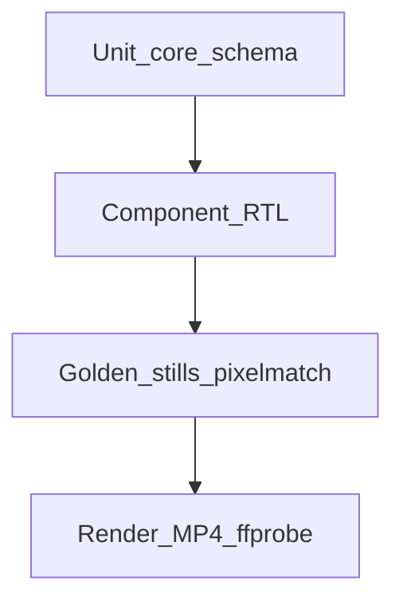

# Testing strategy and plan

Normative testing strategy for Storyboard. Complements the stub in [03-technical-requirements.md](./03-technical-requirements.md) §11.

## 1. Goals

| Goal | Requirement IDs |
|------|-----------------|
| Frame-deterministic pixels for the same inputs | F-R1, F-R2 |
| Correct duration and transition overlap math | F-V4, F-T3 |
| Multi-format dimensions and identical timeline length | F-CLI5, F-V2 |
| Audio mux present with expected duration | F-A1–F-A6, F-E3 |
| Schema / asset validation fails fast | F-CLI4, F-CLI6 |
| Frame-driven motion APIs behave correctly | F-C2 |

Coverage is **requirement-mapped**, not a raw percentage target. Every public export in `@storyboard/core`, `@storyboard/schema`, and `@storyboard/transitions` should have at least one unit or component test.

## 2. Test pyramid



| Layer | What it proves | Speed |
|-------|----------------|-------|
| Unit | Pure math, schema parse/validate, placements | Fast |
| Component | Sequence / Series / TransitionSeries with fixed frame provider | Fast |
| Golden stills | `renderStill` pixels match committed PNGs | Medium (Chromium) |
| Render / smoke | Short MP4 encode + ffprobe; hello-explainer dual-format | Slow |

## 3. Commands

| Command | Scope |
|---------|-------|
| `yarn test` | Unit + component + golden stills |
| `yarn test:unit` | Package unit/component only (jsdom) |
| `yarn test:integration` | Golden stills only |
| `yarn test:render` | Short fixture MP4s + ffprobe |
| `yarn test:smoke` | Full `hello-explainer` dual-format render + ffprobe |
| `yarn test:update-goldens` | Regenerate `examples/*/expected/still-frame-*.png` |
| `yarn test:coverage` | Vitest coverage for packages |

## 4. Accuracy contract

### Golden stills

- Reference PNGs live under `examples/<fixture>/expected/still-frame-<formatId>-<n>.png`.
- Diff library: `pixelmatch` + `pngjs`.
- Per-pixel colour threshold: **0.1**.
- Fail if more than **0.5%** of pixels differ.
- On failure, write a diff PNG to `out/test-diffs/<fixture>-frame-<n>-diff.png`.
- Update goldens only after intentional visual changes via `yarn test:update-goldens`.

### Rendered MP4s

- Do **not** commit MP4s (regenerated in tests; gitignored under `out/` and `examples/*/out/`).
- Assert with ffprobe:
  - Video codec H.264
  - Width / height match the selected format
  - Duration within **one frame** of `totalDurationInFrames / fps`
  - Frame count within **1** of expected when reported
  - AAC audio stream present unless `silent: true`

### Font policy

Focused fixtures use solid colours and no text (or only optional ASCII without custom fonts). `hello-explainer` may use system serif stacks (`Georgia, 'Times New Roman', serif`).

## 5. Fixture catalogue

| Fixture | Purpose | Key assertions |
|---------|---------|----------------|
| `examples/solid-frames` | Deterministic paint | Frames 0 / 15 / 29 solid colours; 30-frame silent MP4 |
| `examples/fade-overlap` | Transition math + fade | Mid-fade blend; duration = sum − overlap |
| `examples/multi-format` | 16:9 + 9:16 | Still dimensions; both MP4s same frame count |
| `examples/audio-mix` | Series audio | AAC present; duration ≈ lead-in + content + tail; silent omits audio |
| `examples/motion-basics` | interpolate + spring | Stills at known frames |
| `examples/motion-lab` | Typewriter, float, pulse, slide, stagger, spring, progress, rotate + frame timeline | Sampled stills + dual-render determinism |
| `examples/hello-explainer` | Full smoke | Lead-in / scene / mid-fade stills; `test:smoke` both formats |

Each fixture includes `expected/expectations.json`:

```json
{
  "fps": 30,
  "durationInFrames": 30,
  "formats": ["16x9"],
  "stills": [0, 15, 29],
  "silent": true
}
```

Golden still filenames are `still-frame-<formatId>-<n>.png` (for example `still-frame-16x9-0.png`).

## 6. CI prerequisites

- Node.js 22+
- Yarn 1.x
- FFmpeg + ffprobe on `PATH`
- Chromium via `yarn workspace @storyboard/renderer exec playwright install chromium`

Suggested CI matrix: `yarn test` on every PR; `yarn test:render` on every PR; `yarn test:smoke` optional / nightly (slower).

## 7. Mapped test cases

| Requirement | Tests / fixtures |
|-------------|------------------|
| F-V4 / F-T3 duration + overlap | `packages/schema/src/duration.test.ts`, `fade-overlap` |
| F-CLI4 validate | `packages/schema/src/validate.test.ts`, CLI spawn tests |
| F-CLI6 exit non-zero | `packages/cli` validate failure tests |
| F-C2 frame APIs | `interpolate.test.ts`, `Series.test.tsx`, `motion-basics` |
| F-T2 fade | `TransitionSeries.test.tsx`, `fade-overlap` goldens |
| F-R1 determinism | Golden stills (re-run same still → match) |
| F-CLI5 multi-format | `multi-format` stills + `test:render` |
| F-A* audio mux | `audio-mix` `test:render` |
| F-E3 lead-in | `audio-mix`, `hello-explainer` duration |
| F-P3 still capture | Integration golden stills |
| F-CLI1 render MP4 | `test:render`, `test:smoke` |

## 8. Updating goldens

1. Change visual behaviour intentionally.
2. Run `yarn test:update-goldens`.
3. Visually inspect changed PNGs under `examples/*/expected/`.
4. Commit the updated goldens with the code change.
5. Re-run `yarn test` to confirm diffs pass.

Do not update goldens to silence a flaky failure without understanding the pixel change.
