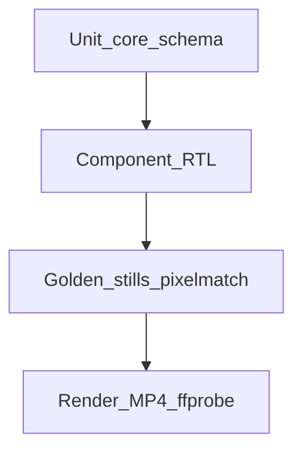

# Testing strategy and plan

Normative testing strategy for First Take. Complements the stub in [03-technical-requirements.md](./03-technical-requirements.md) §11.

## 1. Goals

| Goal | Requirement IDs |
|------|-----------------|
| Frame-deterministic pixels for the same inputs | F-R1, F-R2 |
| Correct track duration math | F-V4, F-T3 |
| Multi-format dimensions and identical timeline length | F-CLI5, F-V2 |
| Audio mux present with expected duration | F-A1–F-A6, F-E3 |
| Schema / asset validation fails fast | F-CLI4, F-CLI6 |
| Frame-driven motion APIs behave correctly | F-C2 |

Coverage is **requirement-mapped**, not a raw percentage target. Every public export in `@levi-putna/storyboard-core`, `@levi-putna/storyboard-schema`, and `@levi-putna/storyboard-transitions` should have at least one unit or component test.

## 2. Test pyramid



| Layer | What it proves | Speed |
|-------|----------------|-------|
| Unit | Pure math, schema parse/validate, placements | Fast |
| Component | Sequence / Series / TransitionSeries with fixed frame provider | Fast |
| Golden stills | `renderStill` pixels match committed PNGs | Medium (Chromium) |
| Render / smoke | Short MP4 encode + ffprobe; hello-explainer dual-format | Slow |

## 3. Commands

| Command | Scope |
|---------|-------|
| `pnpm test` | Unit + component + golden stills |
| `pnpm test:unit` | Package unit/component only (jsdom) |
| `pnpm test:integration` | Golden stills only |
| `pnpm test:render` | Short fixture MP4s + ffprobe |
| `pnpm test:smoke` | Full `hello-explainer` dual-format render + ffprobe |
| `pnpm test:update-goldens` | Regenerate `examples/*/expected/still-frame-*.png` |
| `pnpm test:coverage` | Vitest coverage for packages |

## 4. Accuracy contract

### Golden stills

- Reference PNGs live under `examples/<fixture>/expected/still-frame-<formatId>-<n>.png`.
- Diff library: `pixelmatch` + `pngjs`.
- Per-pixel colour threshold: **0.1**.
- Fail if more than **0.5%** of pixels differ.
- On failure, write a diff PNG to `out/test-diffs/<fixture>-frame-<n>-diff.png`.
- Update goldens only after intentional visual changes via `pnpm test:update-goldens`.

### Rendered MP4s

- Test encodes are regenerated in CI; they are gitignored under `out/` and `examples/*/out/`.
- Documentation previews (`examples/<slug>/preview.mp4`, plus `preview-9x16.mp4` for dual-format examples) are committed so each example README can play the render. Do not treat those files as test oracles.
- Assert with ffprobe:
  - Video codec H.264
  - Width / height match the selected format
  - Duration within **one frame** of `totalDurationInFrames / fps`
  - Frame count within **1** of expected when reported
  - AAC audio stream present unless `silent: true`

### Font policy

Focused fixtures use solid colours and no text (or only optional ASCII without custom fonts). `hello-explainer` may use system serif stacks (`Georgia, 'Times New Roman', serif`).

## 5. Fixture catalogue

| Fixture | Purpose | Key assertions |
|---------|---------|----------------|
| [`solid-frames`](../examples/solid-frames/README.md) | Deterministic paint | Frames 0 / 15 / 29 solid colours; 30-frame silent MP4 |
| [`fade-overlap`](../examples/fade-overlap/README.md) | Cross-track fade | Mid-fade blend on two tracks |
| [`circle-wipe`](../examples/circle-wipe/README.md) | Iris wipe | Close / black / open stills |
| [`multi-format`](../examples/multi-format/README.md) | 16:9 + 9:16 | Still dimensions; both MP4s same frame count |
| [`audio-mix`](../examples/audio-mix/README.md) | Series audio | AAC present; duration ≈ lead-in + content + tail; silent omits audio |
| [`motion-basics`](../examples/motion-basics/README.md) | interpolate + spring | Stills at known frames |
| [`motion-lab`](../examples/motion-lab/README.md) | Typewriter, float, pulse, slide, stagger, spring, progress, rotate + frame timeline | Sampled stills + dual-render determinism |
| [`hello-explainer`](../examples/hello-explainer/README.md) | Full smoke | Lead / scene / mid-fade stills; `test:smoke` both formats |
| [`track-overlay`](../examples/track-overlay/README.md) | Stacked tracks | Background + gapped overlays; silent render |

Authoring examples (playable README previews; not in the golden / short-render suite): [`first-take-kit`](../examples/first-take-kit/README.md), [`audio-volume-fade`](../examples/audio-volume-fade/README.md), [`clip-trim-fullscreen`](../examples/clip-trim-fullscreen/README.md), [`clip-pip-presenter`](../examples/clip-pip-presenter/README.md), [`clip-overlay-shapes`](../examples/clip-overlay-shapes/README.md), [`clip-zoom-presenter`](../examples/clip-zoom-presenter/README.md), [`clip-hard-cut`](../examples/clip-hard-cut/README.md), [`clip-sound-move`](../examples/clip-sound-move/README.md), [`timeline-alignment`](../examples/timeline-alignment/README.md), [`three-robot`](../examples/three-robot/README.md). Catalogue: [`examples/README.md`](../examples/README.md).

Each fixture includes `expected/expectations.json`:

```json
{
  "fps": 30,
  "durationInFrames": 30,
  "formats": ["16x9"],
  "stills": [0, 15, 29],
  "silent": true
}
```

Golden still filenames are `still-frame-<formatId>-<n>.png` (for example `still-frame-16x9-0.png`).

## 6. CI prerequisites

- Node.js 22+
- pnpm
- FFmpeg + ffprobe on `PATH`
- Chromium via `pnpm --filter @levi-putna/storyboard-renderer exec playwright install chromium`

Suggested CI matrix: `pnpm test` on every PR; `pnpm test:render` on every PR; `pnpm test:smoke` optional / nightly (slower).

## 7. Mapped test cases

| Requirement | Tests / fixtures |
|-------------|------------------|
| F-V4 / F-T3 duration | `packages/schema/src/duration.test.ts`, `fade-overlap`, `circle-wipe` |
| F-CLI4 validate | `packages/schema/src/validate.test.ts`, CLI spawn tests |
| F-CLI6 exit non-zero | `packages/cli` validate failure tests |
| F-C2 frame APIs | `interpolate.test.ts`, `Series.test.tsx`, `motion-basics` |
| F-T2 in-scene blend | `fade-overlap`, `circle-wipe` goldens |
| F-R1 determinism | Golden stills (re-run same still → match) |
| F-CLI5 multi-format | `multi-format` stills + `test:render` |
| F-A* audio mux | `audio-mix` `test:render` |
| F-E3 opening bumper / mix | `audio-mix`, `hello-explainer` duration |
| F-P3 still capture | Integration golden stills |
| F-CLI1 render MP4 | `test:render`, `test:smoke` |

## 8. Updating goldens

1. Change visual behaviour intentionally.
2. Run `pnpm test:update-goldens`.
3. Visually inspect changed PNGs under `examples/*/expected/`.
4. Commit the updated goldens with the code change.
5. Re-run `pnpm test` to confirm diffs pass.

Do not update goldens to silence a flaky failure without understanding the pixel change.
