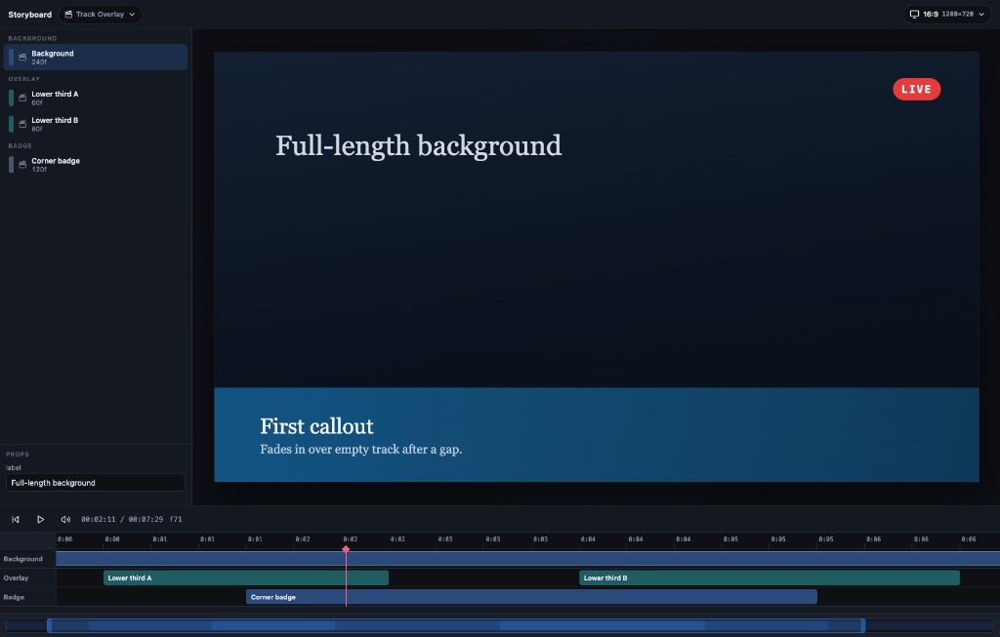

# Storyboard

Frame-deterministic React video engine. You write scenes as React components, describe the timeline in `video.json`, and the CLI renders an MP4.

It is designed for **coding agents** as much as for humans: structured artefacts, a closed CLI loop, and a playbook so an agent can direct a video and generate the content without a black-box generator.

[](https://www.npmjs.com/package/@levi-putna/storyboard)
[](https://nodejs.org)
[](./LICENSE)

```bash
npx @levi-putna/storyboard --help
```

Motion is a function of the current frame. Same inputs always produce the same pixels, so renders stay reproducible.

## Designed for agents

Storyboard treats video the way agents already treat software. You give a brief; the agent writes React scenes, updates a JSON timeline, validates, captures stills, and renders an MP4. Continuity comes from **shared components and props**, not from hoping a generative model keeps the same desk in every shot.

Point the agent at [`AGENT-README.md`](./AGENT-README.md) before it scaffolds a project, writes a scene, or edits `video.json`. That file is the contract: component rules, timeline ownership, motion APIs, and which example to copy.

### Why this is easy to direct

| What agents get | Why it matters |
|-----------------|----------------|
| Declarative `video.json` | Order, duration, tracks, formats, and props are data. Agents edit JSON instead of a hidden edit decision list. |
| Pure React scenes | Each scene is a default-exported component with JSON-serialisable props. Motion is `f(frame, props)`. |
| Deterministic pixels | The same files always produce the same frames, so iterate-and-diff actually works. |
| A closed CLI loop | `create` → write → `validate` → `still` → `preview` → `render`. Broken motion shows up in stills before you wait on an encode. |
| Copyable examples | Motion patterns, overlays, clips, audio mix, dual format. Start from the closest example; do not invent from scratch. |

You stay the director: review stills and the [preview studio](#preview), change the brief, and ask for another pass. Revisions are code edits, not "regenerate and hope".

### Generate content

For a full explainer (brief → script → scenes → narration sync → render → critic), use the [`video-generate-explainer`](.claude/skills/video-generate-explainer/SKILL.md) skill. Instructional design (what to teach, beat structure) is [`designing-training-videos`](.claude/skills/designing-training-videos/SKILL.md).

Typical loop once a project exists:

```bash
npx @levi-putna/storyboard validate video.json
npx @levi-putna/storyboard still video.json --frame=0 --out=out/still.png
npx @levi-putna/storyboard preview video.json
npx @levi-putna/storyboard render video.json --format=16x9
```

## Requirements

You need **Node.js 22+**. FFmpeg and ffprobe ship with the renderer. Override with `--ffmpeg-path` / `--ffprobe-path`, or `STORYBOARD_FFMPEG` / `STORYBOARD_FFPROBE`, if you want a system binary.

## Install

Run the CLI with **npx**. No install required:

```bash
npx @levi-putna/storyboard create my-feature
npx @levi-putna/storyboard render video.json
```

To pin it in a project:

```bash
pnpm add -D @levi-putna/storyboard
npx storyboard render video.json
```

Scene files import the library packages: `@levi-putna/storyboard-core`, `@levi-putna/storyboard-media`, `@levi-putna/storyboard-transitions`, and `@levi-putna/storyboard-schema`.

## Quick start

```bash
npx @levi-putna/storyboard create my-feature
cd my-feature
pnpm install

npx @levi-putna/storyboard validate video.json
npx @levi-putna/storyboard preview video.json
npx @levi-putna/storyboard render video.json
```

`create` writes `video.json` (`schemaVersion` 2, `tracks[]`), two scene components, `package.json`, and `assets/audio/`. Pass `--with-audio` for a looping bed track with in-scene `<Audio>`; `--force` overwrites a non-empty folder.

Rendered files land in `out/` (for example `out/my-feature-16x9.mp4`). Use `--format=16x9` and `--out=out/hello.mp4` to pin a single format and path.

Then:

1. Edit scenes under `src/scenes/`.
2. Adjust tracks, formats, and props in `video.json`. Spec: [`.doc/06-video-json-schema.md`](.doc/06-video-json-schema.md).
3. Optional: drop MP3s into `assets/audio/` and play them with `<Audio>` inside a scene.

Drive all motion from `useCurrentFrame()`. Do not use CSS transitions or animations. Scenes are pure React components with props; `video.json` owns the timeline.

Agent playbook (read this first): [`AGENT-README.md`](./AGENT-README.md).  
Authoring detail: [`.doc/07-authoring-guide.md`](.doc/07-authoring-guide.md).  
Component contract: [`.doc/10-component-requirements.md`](.doc/10-component-requirements.md).  
Real footage (trim, PIP, overlays): [`.doc/09-video-clips.md`](.doc/09-video-clips.md).

## Preview

`preview` opens a local studio in the browser. It plays the same React scenes and `video.json` timeline as render, so the stage matches the MP4.



The screenshot is [`track-overlay`](./examples/track-overlay/README.md): a full-length background, two lower thirds with a gap between them, and a corner badge on its own track.

The studio is split into three panes:

- **Sidebar** — scenes grouped by track, plus a props inspector for the selection
- **Stage** — the composition at the current format (switch 16:9 / 9:16, or add a format, from the toolbar)
- **Timeline** — play / pause, mute, timecode, and one lane per track

While authoring:

- Play and scrub the playhead. Mute lives in the dock. Preview audio is audible but not sample-accurate.
- Double-click a clip to isolate that scene on a local clock. Other tracks unmount, including their audio. Back restores the full video.
- Drag clips to reposition or trim their end; drop onto another track. Add tracks, edit track title and description, and reorder render order from the sidebar.
- Sidebar prop edits are live overrides. **Save to video.json** (or ⌘S / Ctrl+S) writes props and timeline edits to the open file so `render` / `still` pick them up.

```bash
npx @levi-putna/storyboard preview video.json
npx @levi-putna/storyboard preview video.json --port=3333 --no-open
```

## CLI

| Command | Purpose |
|---------|---------|
| `create <slug>` | Scaffold a project. `--dir`, `--title`, `--with-audio`, `--force` |
| `validate <video.json>` | Check the manifest and assets. `--no-assets` skips file existence |
| `preview <video.json>` | Studio in the browser. `--port`, `--no-open` |
| `still <video.json> --frame=N` | Capture one PNG. `--format`, `--out` |
| `render <video.json>` | Encode MP4(s). `--format=16x9\|all`, `--out`, `--concurrency`, `--keep-frames` |

`--silent` and `--no-audio` mute audio in the encode. They do not quiet logs.

Global `--verbose` prints FFmpeg output and phase detail. Without it, the CLI prints progress and errors only.

```bash
npx @levi-putna/storyboard render video.json --format=16x9 --out=out/hello.mp4
npx @levi-putna/storyboard still video.json --frame=0 --out=out/still.png
npx @levi-putna/storyboard render video.json --verbose
```

## Packages

| Package | Role |
|---------|------|
| [`@levi-putna/storyboard`](https://www.npmjs.com/package/@levi-putna/storyboard) | `storyboard` CLI |
| [`@levi-putna/storyboard-schema`](https://www.npmjs.com/package/@levi-putna/storyboard-schema) | `video.json` Zod schema and duration helpers |
| [`@levi-putna/storyboard-core`](https://www.npmjs.com/package/@levi-putna/storyboard-core) | Frame context, Sequence, interpolate, spring, composition |
| [`@levi-putna/storyboard-media`](https://www.npmjs.com/package/@levi-putna/storyboard-media) | Img, Audio, staticFile |
| [`@levi-putna/storyboard-transitions`](https://www.npmjs.com/package/@levi-putna/storyboard-transitions) | Fade TransitionSeries |
| [`@levi-putna/storyboard-renderer`](https://www.npmjs.com/package/@levi-putna/storyboard-renderer) | Vite bundle, Playwright capture, FFmpeg encode |
| [`@levi-putna/storyboard-preview`](https://www.npmjs.com/package/@levi-putna/storyboard-preview) | Studio: multi-lane timeline and audible preview |

## Develop

This repository is a Yarn 1.x workspaces monorepo. Clone it when you want to change the engine, not when you only want to make a video.

```bash
git clone https://github.com/levi-putna/storyboard.git
cd storyboard
yarn install
yarn build
```

### Examples

Compositions in [`examples/`](./examples/README.md) are workspaces. Each example README embeds a playable `preview.mp4` (16:9, plus 9:16 where the composition has both). After install and build, preview or render any of them:

```bash
npx @levi-putna/storyboard validate examples/hello-explainer/video.json
npx @levi-putna/storyboard preview examples/hello-explainer/video.json
npx @levi-putna/storyboard still examples/hello-explainer/video.json --frame=0 --out=out/still.png
npx @levi-putna/storyboard render examples/hello-explainer/video.json
```

`npx @levi-putna/storyboard create <slug>` from the repo root writes into `examples/<slug>/`. After scaffolding, run `yarn install` so the new workspace is linked, then validate, preview, and render as above.

| Example | What it does |
|---------|----------------|
| [`hello-explainer`](./examples/hello-explainer/README.md) | Dual-format explainer: visual track + spanning mix (jingle, bed, narration) |
| [`track-overlay`](./examples/track-overlay/README.md) | Long background, gapped transparent overlays, corner badge for z-order |
| [`first-take-kit`](./examples/first-take-kit/README.md) | `TitleCard` scene used by the First Take macOS editor |
| [`motion-basics`](./examples/motion-basics/README.md) | Frame-driven `interpolate` and `spring` on a simple block |
| [`motion-lab`](./examples/motion-lab/README.md) | Catalogue of patterns (typewriter, float, pulse, slide, stagger, spring, progress, rotate) plus a frame timeline |
| [`solid-frames`](./examples/solid-frames/README.md) | Solid colour hold (deterministic paint fixture) |
| [`fade-overlap`](./examples/fade-overlap/README.md) | Two scenes with a 10-frame fade; total duration is sum minus overlap |
| [`multi-format`](./examples/multi-format/README.md) | Same composition rendered in 16:9 and 9:16 |
| [`audio-mix`](./examples/audio-mix/README.md) | Visual track plus in-scene jingle / looping bed / narration |
| [`audio-volume-fade`](./examples/audio-volume-fade/README.md) | Looped bed with a V-shaped volume envelope (fade out, then back in) |
| [`clip-trim-fullscreen`](./examples/clip-trim-fullscreen/README.md) | Full-screen clip trimmed with `startFrom` / `endAt` |
| [`clip-pip-presenter`](./examples/clip-pip-presenter/README.md) | Presenter picture-in-picture in the corner over motion graphics |
| [`clip-overlay-shapes`](./examples/clip-overlay-shapes/README.md) | Full-screen clip with animated shapes on top |
| [`clip-zoom-presenter`](./examples/clip-zoom-presenter/README.md) | Ken Burns zoom in, hold, then zoom out on presenter footage |
| [`clip-hard-cut`](./examples/clip-hard-cut/README.md) | Two clips back-to-back with no transition |
| [`clip-sound-move`](./examples/clip-sound-move/README.md) | Sound-on clip that drifts around the frame |
| [`timeline-alignment`](./examples/timeline-alignment/README.md) | 5-minute fixture: colour holds every 10s plus a per-second counter overlay |

### Tests

Full strategy, fixture catalogue, and accuracy contract: [`.doc/08-testing-strategy.md`](.doc/08-testing-strategy.md).

| Command | What it runs |
|---------|----------------|
| `yarn test` | Unit + component + golden stills |
| `yarn test:unit` | Package unit and component tests |
| `yarn test:integration` | Golden still pixel diffs |
| `yarn test:render` | Short fixture MP4s + ffprobe |
| `yarn test:smoke` | Full `hello-explainer` dual-format render |
| `yarn test:update-goldens` | Regenerate `examples/*/expected/still-frame-*.png` |
| `yarn test:coverage` | Unit coverage report |

After intentional visual changes, run `yarn test:update-goldens`, inspect the PNGs under `examples/*/expected/`, and commit them with the code.

Golden stills and render fixtures live under [`examples/`](./examples/README.md). `motion-lab` also re-renders sampled frames twice and pixel-compares them for determinism. Regenerate synthetic audio for `audio-mix` with `yarn generate:fixture-audio`.

### Documentation

Architecture, requirements, and the timing model live in [`.doc/`](.doc/). Playable examples: [`examples/README.md`](./examples/README.md). Agent playbook: [`AGENT-README.md`](./AGENT-README.md). Explainer production skill: [`.claude/skills/video-generate-explainer/SKILL.md`](.claude/skills/video-generate-explainer/SKILL.md). Changelog: [`CHANGELOG.md`](CHANGELOG.md).

Issues and pull requests: [github.com/levi-putna/storyboard](https://github.com/levi-putna/storyboard).

## Licence

[MIT](./LICENSE). Independent clean-room implementation. Do not copy Remotion source into this repository.

## About

Built by [Levi Putna](https://www.twistedbrackets.com). More writing, tools, and agent skills at [Twisted Brackets](https://www.twistedbrackets.com).
