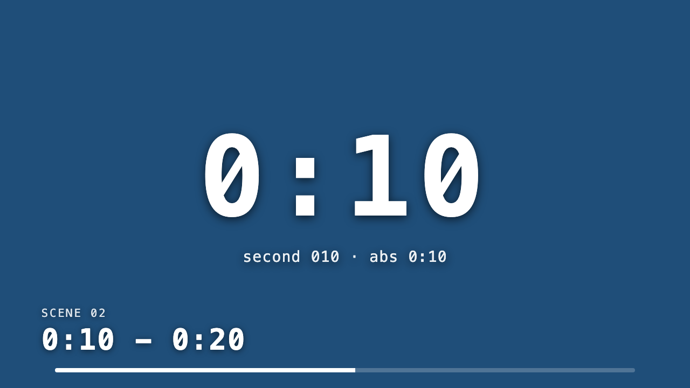

# Timeline Alignment

Five-minute fixture for checking playhead and clip alignment. The background track hard-cuts between two colours every 10 seconds. The overlay track has one clip per elapsed second from composition start (`0:00` through `4:59`).

If a second-clip is on the wrong frame, the overlay outlines the clock in red (`Timeline mismatch`): the declared second no longer matches `floor(absoluteFrame / fps)`. Colour-block labels (`0:00 - 0:10`, `0:10 - 0:20`, ...) should change on the same beat as `0:10`, `0:20`, and so on.

Composition length is 9000 frames (5:00 at 30 fps). The still below is frame 315 (`0:10` + 15f). Play the full five minutes in the studio — a committed MP4 of this fixture would be too long to keep in git.

Catalogue: [examples/README.md](../README.md).

## Preview



```bash
pnpm first-take preview examples/timeline-alignment/video.json
```

## Tracks

| Track | Layout |
|-------|--------|
| Background | 30 colour holds, 300f (10s) each, red / navy alternating |
| Counter | 300 one-second clips (30f), counting `0:00` … `4:59` |

## Commands

```bash
pnpm first-take validate examples/timeline-alignment/video.json
pnpm first-take preview examples/timeline-alignment/video.json
pnpm first-take render examples/timeline-alignment/video.json --format=16x9 --silent
```
